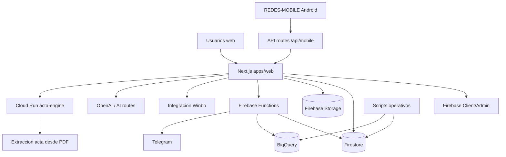
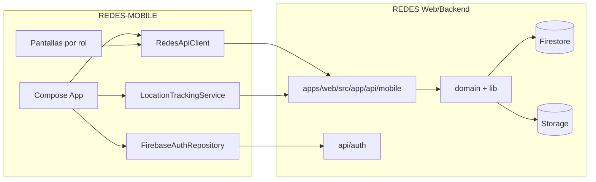
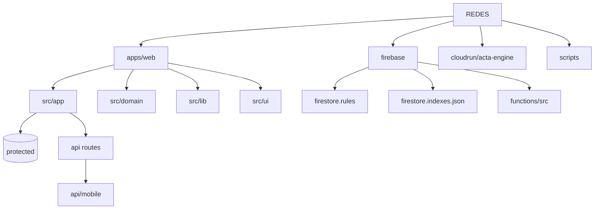
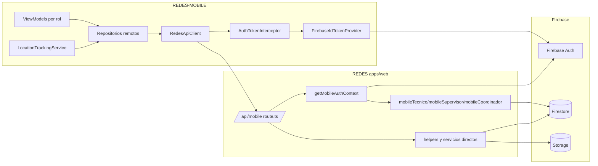
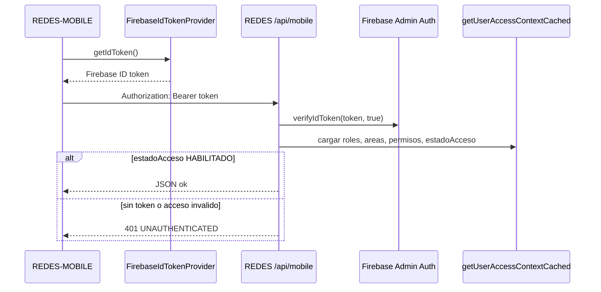
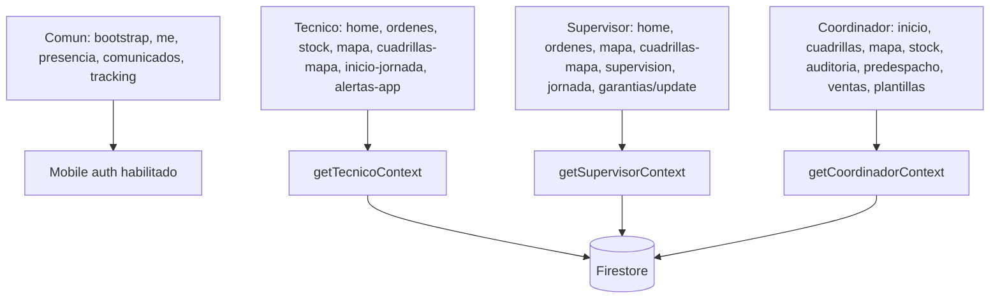
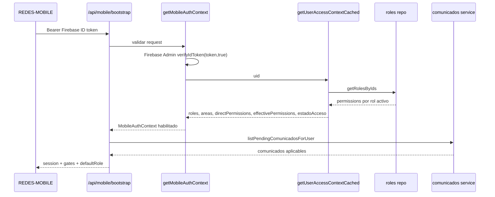
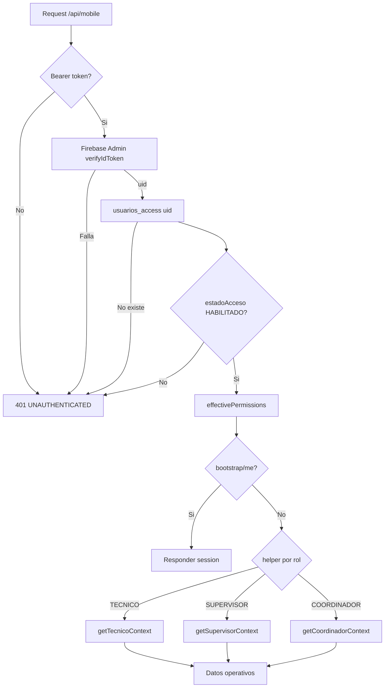

# Diagramas Iniciales - REDES

Estado: Fase 0, alto nivel.

## Arquitectura REDES

## Relacion REDES / REDES-MOBILE

## Unidades Iniciales

## API Mobile REDES + REDES-MOBILE Network

Estado: deep dive 2026-06-13, unidad en **Revisar**.

## Flujo De Token Mobile

## Grupos De Endpoints Por Rol

## Auth/RBAC Mobile Y Bootstrap

Estado: deep dive 2026-06-14, unidad en **Revisar**.

## Decision RBAC Mobile

