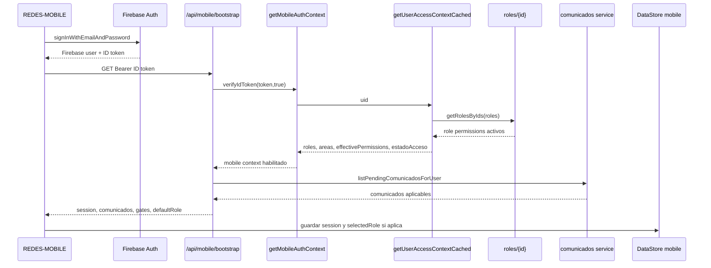
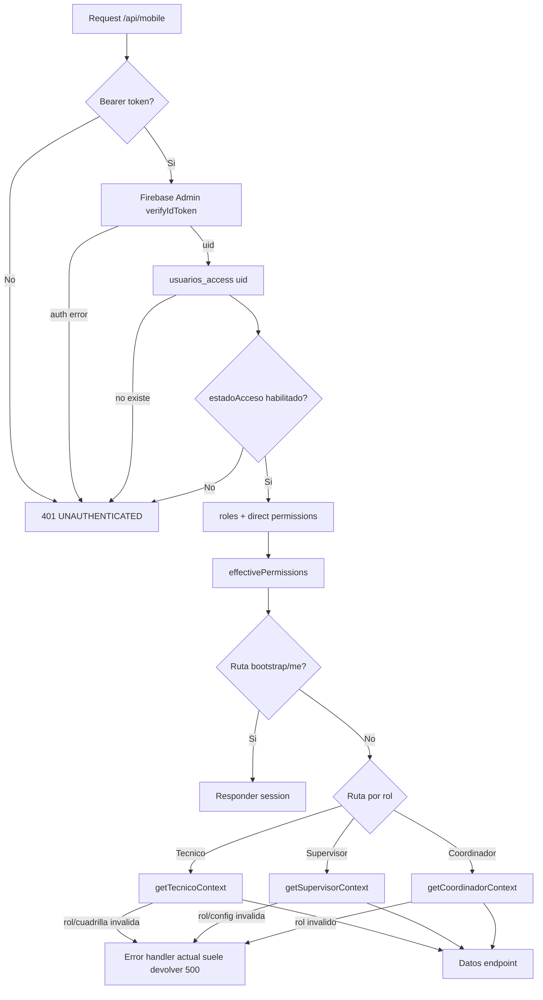

# Auth, RBAC Y Bootstrap Mobile - REDES

Actualizado: 2026-06-14.

Estado de la unidad: **Revisar**. La lectura cubre validacion de token Firebase, `usuarios_access`, permisos efectivos, roles, bootstrap mobile, `/api/mobile/me`, comunicados y cruce con lo que REDES-MOBILE espera.

## Alcance Leido

Backend REDES:

- `C:\Proyectos\REDES\apps\web\src\core\auth\mobile.ts`
- `C:\Proyectos\REDES\apps\web\src\core\auth\mobileBootstrap.ts`
- `C:\Proyectos\REDES\apps\web\src\core\auth\accessContext.ts`
- `C:\Proyectos\REDES\apps\web\src\core\auth\accessContext.cached.ts`
- `C:\Proyectos\REDES\apps\web\src\core\auth\mobileTecnico.ts`
- `C:\Proyectos\REDES\apps\web\src\core\auth\mobileSupervisor.ts`
- `C:\Proyectos\REDES\apps\web\src\core\auth\mobileCoordinador.ts`
- `C:\Proyectos\REDES\apps\web\src\core\rbac\homeRoute.ts`
- `C:\Proyectos\REDES\apps\web\src\core\rbac\menu.ts`
- `C:\Proyectos\REDES\apps\web\src\core\rbac\buildHomeNav.ts`
- `C:\Proyectos\REDES\apps\web\src\lib\rbac.ts`
- `C:\Proyectos\REDES\apps\web\src\domain\roles\repo.ts`
- `C:\Proyectos\REDES\apps\web\src\domain\comunicados\service.ts`
- `C:\Proyectos\REDES\apps\web\src\app\api\mobile\bootstrap\route.ts`
- `C:\Proyectos\REDES\apps\web\src\app\api\mobile\me\route.ts`
- `C:\Proyectos\REDES\apps\web\src\app\api\mobile\comunicados\[id]\seen\route.ts`

Android cruzado:

- `C:\Proyectos\REDES-MOBILE\app\src\main\java\com\redes\app\data\session\*.kt`
- `C:\Proyectos\REDES-MOBILE\app\src\main\java\com\redes\app\network\RedesApiClient.kt`
- `C:\Proyectos\REDES-MOBILE\app\src\main\java\com\redes\app\network\dto\MobileBootstrapDto.kt`
- `C:\Proyectos\REDES-MOBILE\app\src\main\java\com\redes\app\network\dto\MobileSessionDto.kt`
- `C:\Proyectos\REDES-MOBILE\app\src\main\java\com\redes\app\ui\home\*.kt`
- `C:\Proyectos\REDES-MOBILE\app\src\main\java\com\redes\app\ui\navigation\AppNavHost.kt`
- `C:\Proyectos\REDES-MOBILE\app\src\main\java\com\redes\app\ui\screens\RoleSelectionScreen.kt`

## Auth Mobile Backend

`getMobileAuthContext(req)` en `core/auth/mobile.ts` es la puerta comun para `/api/mobile/bootstrap`, `/api/mobile/me` y la mayoria de rutas mobile:

1. Lee `Authorization: Bearer <token>`.
2. Verifica Firebase ID token con `adminAuth().verifyIdToken(token, true)`.
3. Extrae `uid` y `email`.
4. Carga `getUserAccessContextCached(uid)`.
5. Rechaza si no hay access context o `estadoAcceso !== "HABILITADO"`.
6. Retorna `{ uid, email, access }`.

Resultado importante: usuario sin `usuarios_access/{uid}` o con acceso inhabilitado se convierte en `null`, igual que token ausente/invalido para las rutas que devuelven `UNAUTHENTICATED`.

## Access Context Y Permisos

`getUserAccessContext(uid)` lee `usuarios_access/{uid}`:

- `roles`: array de strings.
- `areas`: array de strings.
- `permissions`: permisos directos del usuario.
- `estadoAcceso`: normaliza `HABILITADO` y valor historico `ACTIVO` a `HABILITADO`; todo lo demas queda `INHABILITADO`.

Luego lee `roles/{id}` via `getRolesByIds`:

- Ignora permisos de roles con `estado` distinto de `ACTIVO`.
- Suma `rolePermissions` desde `roles/{id}.permissions`.
- Construye `effectivePermissions = uniq(rolePermissions + directPermissions)`.

`getUserAccessContextCached` agrega cache en produccion:

- TTL default: `ACCESS_CONTEXT_CACHE_TTL_MS` o `60000` ms.
- Maximo 500 entradas.
- `forceRefresh` o TTL <= 0 fuerza lectura fresca.
- `invalidateUserAccessContext(uid?)` limpia una entrada o todo el cache.

Riesgo: cambios de permisos/roles pueden tardar hasta el TTL en mobile si no se invalida el cache.

## Bootstrap Mobile

`/api/mobile/bootstrap`:

- Fuente: `apps\web\src\app\api\mobile\bootstrap\route.ts`.
- Runtime: `nodejs`, `force-dynamic`.
- Auth: `getMobileAuthContext`.
- OK: retorna `{ ok: true, ...buildMobileBootstrap(mobile) }`.
- Error auth: `{ ok: false, error: "UNAUTHENTICATED" }` con 401.
- Errores con codigo `auth/*`: 401; otros errores: 500.

`buildMobileBootstrap`:

- Carga perfil desde `usuarios/{uid}` con `getMobileProfile`.
- Pide comunicados pendientes con `listPendingComunicadosForUser`.
- Normaliza roles a uppercase.
- Calcula `defaultRole` con `getDefaultRoleForRoles`.
- Calcula `requiresComunicadosGate` cuando hay comunicado obligatorio `ONCE`.
- Retorna session con `uid`, `email`, `nombre`, `nombreCorto`, `roles`, `areas`, `permissions`, `estadoAcceso`, `isAdmin`.

Contrato esperado por Android:

| Campo backend | Consumidor Android | Observacion |
| --- | --- | --- |
| `session.roles` | `HomeViewModel`, `RoleSelectionScreen`, `AppNavHost` | Solo tres roles tienen shell especializado. |
| `session.permissions` | `HomeScreen` | Se muestra; no se encontro gating mobile por permiso. |
| `session.estadoAcceso` | `MobileSession`, cache | Backend ya filtro no habilitados antes de responder. |
| `comunicados` | `ComunicadosScreen` | `ONCE` obligatorio bloquea por gate. |
| `requiresComunicadosGate` | `AppNavHost` | Tiene prioridad sobre role selection. |
| `roleSelectionRequired` | `HomeUiState.needsRoleSelection` | Backend lo setea por `roles.length > 1`. |
| `defaultRole` | `HomeViewModel.applyBootstrap` | Usa prioridad web de `homeRoute.ts`. |

## `/api/mobile/me`

`/api/mobile/me`:

- Fuente: `apps\web\src\app\api\mobile\me\route.ts`.
- Auth: `getMobileAuthContext`.
- Respuesta: `{ ok, uid, email, nombre, nombreCorto, roles, areas, permissions, estadoAcceso }`.
- Android tiene `RedesApiClient.fetchCurrentSession(idToken)` y `MobileEndpoints.ME`.
- No se encontro consumidor directo de `fetchCurrentSession` en REDES-MOBILE durante esta unidad.

Estado: endpoint existente pero probablemente legado/fallback respecto del flujo actual, que usa bootstrap.

## Comunicados

Backend:

- `listPendingComunicadosForUser` lista ultimos comunicados, filtra `estado === "ACTIVO"` y rango visible.
- Targets: `ALL`, `ROLES`, `AREAS`, `USERS`.
- `ONCE`: requiere no estar visto en `usuarios_access/{uid}/comunicados_reads/{comunicadoId}`.
- `ALWAYS`: siempre aparece aunque este visto.
- `markComunicadoSeen` escribe `seenAt` y `seenByUid` bajo `usuarios_access/{uid}/comunicados_reads/{id}`.

Mobile:

- `requiresComunicadosGate` solo bloquea con `obligatorio && persistencia === "ONCE"`.
- `POST /api/mobile/comunicados/{id}/seen`, validado con `Get-Content -LiteralPath` por ruta con `[id]`, usa `getMobileAuthContext`, rechaza sin Bearer valido con `401 UNAUTHENTICATED`, valida `comunicadoId` no vacio y llama `markMobileComunicadoSeen(mobile.uid, comunicadoId)`.
- Android llama `markComunicadoSeen(id)` desde `RemoteSessionRepository` y luego refresca bootstrap; si el comunicado era obligatorio `ONCE`, al existir `usuarios_access/{uid}/comunicados_reads/{id}` deja de bloquear el gate.

## Roles Y RBAC

Roles operativos backend leidos:

- `getTecnicoContext`: requiere `TECNICO` o `ADMIN`, y cuadrilla donde `tecnicosUids` contiene `uid`.
- `getSupervisorContext`: requiere `SUPERVISOR` o `ADMIN`; ademas revisa configuracion de supervisor y puede lanzar `SUPERVISOR_DISABLED`.
- `getCoordinadorContext`: requiere `COORDINADOR` o `ADMIN`; lista cuadrillas habilitadas con `coordinadorUid == uid`.

RBAC web:

- `core/rbac/homeRoute.ts` define `ROLE_HOME` y prioridad de default role para web.
- `core/rbac/buildHomeNav.ts` usa `session.permissions`, `session.access.areas`, `session.access.roles` e `isAdmin` para menu web.
- `lib/rbac.ts` contiene `canAccess(user, { roles, areas })`, con bypass admin.

Cruce con Android:

- Android no consume `buildHomeNav` ni `canAccess`.
- Android no evalua `permissions` para routing de shells.
- Android usa `selectedRole` textual para elegir shell: `TECNICO`, `SUPERVISOR`, `COORDINADOR`; cualquier otro rol cae en home generico.
- `RoleSelectionScreen` puede mostrar `ADMIN`, `GERENCIA`, `SEGURIDAD` y roles genericos, pero no hay shell especializado para ellos.

## Roles Backend Vs Android

| Rol backend posible por `homeRoute.ts` | Android lo muestra en selector | Shell Android especializado | Riesgo |
| --- | --- | --- | --- |
| `TECNICO` | Si | Si | OK si tiene cuadrilla. |
| `SUPERVISOR` | Si | Si | OK si config supervisor permite. |
| `COORDINADOR` | Si | Si | OK si tiene cuadrillas habilitadas. |
| `ADMIN` | Si | No | Cae a Home generico; backend helpers lo aceptan como bypass por rol. |
| `GERENCIA` | Si | No | Cae a Home generico. |
| `SEGURIDAD` | Si | No | Cae a Home generico. |
| `TI`, `RRHH`, `JEFATURA`, `ALMACEN`, `GESTOR` | Generico si llegan | No | Cae a Home generico; defaultRole puede priorizarlos sobre roles mobile. |

## Permisos Backend Que Android No Usa

Se detectaron permisos usados por web en `buildHomeNav.ts` que Android no evalua en esta unidad:

- `ORDENES_IMPORT`
- `ORDENES_LLAMADAS_VIEW`
- `ORDENES_LLAMADAS_EDIT`
- `ORDENES_LIQUIDAR`
- `ORDENES_MAPA_VIEW`
- `ORDENES_GARANTIAS_VIEW`
- `ORDENES_GARANTIAS_EDIT`
- `INCONCERT_IMPORT`
- `INCONCERT_GERENCIA_VIEW`
- `INCONCERT_GERENCIA_EDIT`
- `USERS_LIST`
- `SUPERVISORES_VIEW`
- `SUPERVISORES_MANAGE`
- `SUPERVISORES_ASISTENCIA_VIEW`
- `GERENCIA_COORDINADORES`
- `GERENCIA_ORDEN_COMPRA`
- `ZONAS_MANAGE`
- `CUADRILLAS_MANAGE`
- `EQUIPOS_IMPORT`
- `EQUIPOS_VIEW`
- `EQUIPOS_EDIT`
- `MATERIALES_CREATE`
- `MATERIALES_VIEW`
- `MATERIALES_TRANSFER_SERVICIO`
- `MATERIALES_DEVOLUCION`
- `EQUIPOS_DESPACHO`
- `EQUIPOS_DEVOLUCION`
- `VENTAS_VER`
- `VENTAS_VER_ALL`
- `VENTAS_DESPACHO_INST`
- `VENTAS_DESPACHO_MANT`

Esto no es necesariamente bug: puede ser que mobile autorice por rol y backend por endpoint. Pero si se espera control fino de UI mobile por permisos, todavia no esta implementado en los archivos leidos.

## Diagrama Login/Bootstrap

## Diagrama De Decision RBAC Mobile

## Hallazgos E Inconsistencias

1. `/api/mobile/me` existe y responde sesion simple, pero Android no lo usa directamente en el flujo actual; bootstrap es la fuente real de sesion.
2. `getMobileAuthContext` colapsa token ausente, access inexistente y `estadoAcceso` inhabilitado en `UNAUTHENTICATED`. Android muestra mensaje de token rechazado para todos esos casos.
3. `defaultRole` reutiliza prioridad web. Para mobile puede elegir `TI`, `RRHH`, `GERENCIA`, `JEFATURA`, `ALMACEN`, `GESTOR` o `SEGURIDAD`, roles sin shell mobile especializado.
4. Android recibe `effectivePermissions`, pero no se encontro uso para habilitar UI/acciones mobile en esta unidad.
5. Cambios de access context pueden quedar cacheados hasta 60 s en produccion.
6. Errores de rol de helpers por endpoint (`ROLE_TECNICO_REQUIRED`, `ROLE_SUPERVISOR_REQUIRED`, `ROLE_COORDINADOR_REQUIRED`) no siempre se traducen a 403; varios handlers devuelven 500 generico.
7. Force update no esta reforzado desde backend mobile; Android lo consulta directo a Firestore y permite entrada si falla la consulta.

## Estado Final De La Unidad

**Revisar**. La documentacion cubre los archivos clave, pero hay decisiones pendientes sobre separacion entre roles web y roles mobile, mensajes de acceso, cache y uso real de permisos en Android.

## Siguiente Unidad Recomendada

`Navegacion y destinos por rol REDES-MOBILE`, cruzada con roles backend y shells por rol.
