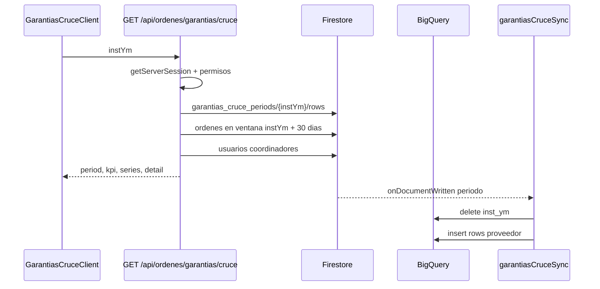

# Cruce de Garantias WIN/REDES

Actualizado: 2026-06-15.

Estado: **Revisar**. Esta unidad fue detectada en la revision incremental diaria y documentada con lectura focalizada, no como cobertura completa de todo el modulo de ordenes.

## Alcance

Fuentes leidas:

- `C:\Proyectos\REDES\apps\web\src\app\api\ordenes\garantias\cruce\route.ts`
- `C:\Proyectos\REDES\apps\web\src\app\api\ordenes\garantias\cruce\import\route.ts`
- `C:\Proyectos\REDES\apps\web\src\app\api\ordenes\garantias\cruce\preview\route.ts`
- `C:\Proyectos\REDES\apps\web\src\app\(protected)\home\ordenes\garantias\cruce\GarantiasCruceClient.tsx`
- `C:\Proyectos\REDES\apps\web\src\core\garantias\cruceProveedor.ts`
- `C:\Proyectos\REDES\firebase\functions\src\garantiasCruceSync.ts`
- `C:\Proyectos\REDES\firebase\functions\src\index.ts`

Fuentes detectadas pero no documentadas en profundidad:

- `scripts\bigquery_garantias_cruce_setup.sql`
- `scripts\bigquery_garantias_dashboard.sql`
- `scripts\bigquery_update_vw_instalacion_garantia.sql`
- `scripts\backfill_garantias_cruce_bq.ts`
- `firebase\functions\backfill_garantias_cruce_bq.ts`

## Proposito

El flujo cruza garantias reportadas por WIN/proveedor contra ordenes internas REDES para un mes de instalacion (`instYm`). La vista web muestra KPIs, brechas, coincidencias, pendientes y exportacion Excel; la API calcula el cruce desde Firestore y datos de proveedor persistidos.

## Componentes Principales

| Pieza | Ruta | Responsabilidad |
| --- | --- | --- |
| Pantalla cliente | `apps\web\src\app\(protected)\home\ordenes\garantias\cruce\GarantiasCruceClient.tsx` | Consume `/api/ordenes/garantias/cruce`, permite cambiar mes, filtrar vistas, ver KPIs/graficos/tablas y exportar Excel. |
| API de cruce | `apps\web\src\app\api\ordenes\garantias\cruce\route.ts` | Autentica sesion web, valida permisos, carga proveedor/ordenes, calcula matching y devuelve detalle/KPIs. |
| Preview proveedor | `apps\web\src\app\api\ordenes\garantias\cruce\preview\route.ts` | Parsea XLSX sin persistir, devuelve resumen, omisiones, meses y muestras por periodo. |
| Import proveedor | `apps\web\src\app\api\ordenes\garantias\cruce\import\route.ts` | Lista periodos importados y guarda imports confirmados reemplazando rows por `instYm`. |
| Parser/persistencia proveedor | `apps\web\src\core\garantias\cruceProveedor.ts` | Lee Excel, normaliza fechas/textos, filtra partner M&D, persiste imports por periodo en Firestore. |
| Sync BigQuery | `firebase\functions\src\garantiasCruceSync.ts` | Al escribir `garantias_cruce_periods/{instYm}`, elimina e inserta filas del periodo en BigQuery. |
| Export functions | `firebase\functions\src\index.ts` | Exporta `garantiasCruceSync` junto con el resto de funciones. |

## API `GET /api/ordenes/garantias/cruce`

Entrada:

- Query `instYm` en formato `YYYY-MM`; si no llega, usa el mes actual menos dos meses.

Control de acceso:

- Requiere `getServerSession()`.
- Rechaza sesion ausente con `401 UNAUTHENTICATED`.
- Rechaza `estadoAcceso` distinto de `HABILITADO` con `403 ACCESS_DISABLED`.
- Permite ver si el usuario es admin, tiene rol `GERENCIA` o `SUPERVISOR`, permiso `ORDENES_GARANTIAS_EDIT`, o permiso `ORDENES_GARANTIAS_VIEW`.

Fuentes de datos:

- Proveedor: `loadProviderRowsFromFirestore(instYm)` desde `garantias_cruce_periods/{instYm}/rows`.
- Ordenes REDES: coleccion `ordenes`, rango `fSoliYmd` desde inicio del mes de instalacion hasta 30 dias despues del fin de mes.
- Usuarios: coleccion `usuarios` para resolver nombres cortos de coordinadores.

Reglas de negocio observadas:

- Solo considera filas proveedor dentro de ventana de 30 dias desde instalacion.
- En REDES detecta garantias por texto de tipo/servicio/estado que incluya `GARANTIA` y excluye atenciones tecnicas cuando `tipoSeguiClien` no es `GAR`.
- Busca instalacion base previa finalizada por cliente/codigo cuando no existe `fechaInstalacionBase`.
- Match proveedor/REDES prioriza `codPedido`, fecha de garantia, fecha de instalacion, estado final/cancelado y similitud de nombre.
- Estados de cruce: `COINCIDE`, `COINCIDE_FECHA_DIFERENTE`, `PROVEEDOR_REDES_PENDIENTE`, `SOLO_PROVEEDOR`.
- Las garantias REDES validas son ordenes GAR con estado `Finalizada` o `Cancelada`.
- `isGarantia` exige texto con `GARANTIA` y excluye atenciones tecnicas cuando `tipoSeguiClien` existe y no es `GAR`.
- `redesSolo` lista garantias finalizadas/canceladas en REDES sin match proveedor.
- Deduplica reincidentes por `codigoCliente` para tasa REDES.
- El denominador de instalaciones finalizadas ahora se limita a tipos explicitos: `INSTALACION`, `INSTALACION POSIBLE FRAUDE`, `WINBOX EN COMODATO`, `MESH + WINBOX EN COMODATO` y `PAGO ADELANTADO`.

Salida:

- `period`: rango de instalacion/garantia, metadata de workbook/import y URL Power BI.
- `kpi`: conteos proveedor, REDES GAR por clientes unicos, ordenes GAR, finalizadas/canceladas, instalaciones finalizadas, tasas, brechas y pendientes.
- `series`: garantias por mes de atencion, por dia y por cuadrilla.
- `detail`: filas de cruce, filas solo REDES, filas proveedor y REDES validas.

Campos KPI relevantes observados el 2026-06-15:

- `redesGarTotal`: clientes unicos REDES GAR finalizados/cancelados; se usa para tasa y brecha.
- `redesGarOrdenes`: cantidad de ordenes GAR finalizadas/canceladas.
- `redesGarFinalizadas` y `redesGarCanceladas`: desglose por estado.
- `coincidenciasGar`: filas WIN que matchean una GAR REDES finalizada o cancelada.
- `proveedorRedesPendiente`: filas WIN con orden REDES encontrada pero aun no finalizada/cancelada.

## Parser De Proveedor

Detalle propio: `docs\contexto\web\garantias-import-preview.md`.

`cruceProveedor.ts` define:

- `parseProviderWorkbook`: resuelve hoja `Garantia`, convierte filas Excel a `ProviderGarantia`, omite filas sin fechas/codigo/cliente o fuera de partner/ventana.
- `saveProviderImport`: crea doc en `garantias_cruce_imports`, agrupa filas por mes de instalacion y reemplaza `garantias_cruce_periods/{instYm}/rows`.
- `listProviderPeriods`: lista hasta 24 periodos importados.
- `loadProviderRowsFromFirestore`: fuente preferida para la API.
- `loadProviderRowsForMonth`: fallback a workbook local si no hay Firestore.

Colecciones inferidas:

- `garantias_cruce_imports`
- `garantias_cruce_periods`
- `garantias_cruce_periods/{instYm}/rows`

## BigQuery

La funcion `garantiasCruceSync` se dispara con `onDocumentWritten` sobre `garantias_cruce_periods/{instYm}` en region `southamerica-west1`.

Comportamiento:

- Si se elimina el periodo, borra filas BigQuery del `inst_ym`.
- Si existe, lee subcoleccion `rows`.
- Elimina filas del periodo antes de insertar.
- Inserta en batches de 500 en `redes-5bb81.ordenes_export.garantias_proveedor_rows`.

Riesgos:

- La estrategia delete+insert por periodo evita duplicados, pero si la insercion parcial falla despues del delete puede dejar el periodo incompleto en BigQuery.
- `PROJECT`, `DATASET` y `TABLE` estan hardcodeados en la funcion.
- Los SQL/backfills fueron documentados en `docs\contexto\scripts\maintenance-scripts.md` el 2026-06-15. Comparten el mismo destino `redes-5bb81.ordenes_export.garantias_proveedor_rows`, eliminan por periodo antes de insertar y requieren credenciales/entorno operativo.

Scripts detectados:

- `scripts\backfill_garantias_cruce_bq.ts`: sincroniza todos los periodos Firestore hacia BigQuery.
- `firebase\functions\backfill_garantias_cruce_bq.ts`: variante dentro de functions, pendiente de comparar contra el script raiz.
- `scripts\bigquery_garantias_cruce_setup.sql`: crea tabla `garantias_proveedor_rows` y vista `vw_pbi_cruce_garantias`, cruzando WIN con `vw_pbi_instalacion_garantia` para GAR finalizadas/canceladas.
- `scripts\bigquery_garantias_dashboard.sql` y `scripts\bigquery_update_vw_instalacion_garantia.sql`: pendientes de lectura profunda.

## Flujo

## Pendientes

- Documentar rutas `import` y `preview`.
- Validar riesgos operativos de SQL/backfills BigQuery antes de cualquier automatizacion de datos.
- Revisar reglas Firestore/seguridad sobre `garantias_cruce_imports` y `garantias_cruce_periods`.
- Validar con Arturo si `GERENCIA` y `SUPERVISOR` deben tener acceso por rol directo sin permiso explicito.
- Validar si `preview` debe exigir permiso de edicion por exponer nombres/codigos de clientes.
- Revisar posible carrera: `saveProviderImport` toca el doc padre antes de insertar rows, mientras `garantiasCruceSync` se dispara por ese doc padre.
- Revisar tolerancia ante fallas parciales en sync BigQuery.
- Validar con negocio que tasa REDES debe usar clientes unicos GAR finalizados/cancelados, mientras los listados conservan ordenes.

## Siguiente Unidad Recomendada

`Firebase rules, colecciones e indexes`, porque las colecciones de garantias ya estan mapeadas y falta cerrar la frontera de seguridad general.
