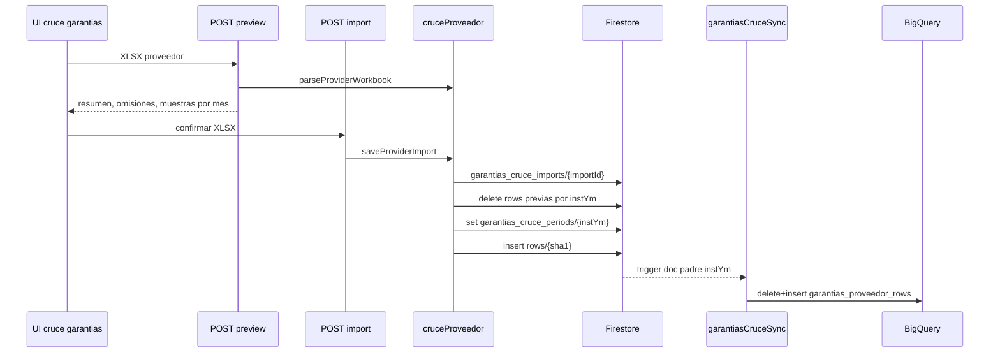

# Garantias Cruce - Import y Preview

Actualizado: 2026-06-15.

Estado: **Revisar**. Deep dive focalizado en las rutas de carga del workbook proveedor para el cruce WIN/REDES. No se ejecuto ningun import ni se abrio el archivo sensible `BBDD_M&D_01-06-2026.xlsx`.

## Alcance

Fuentes leidas:

- `apps\web\src\app\api\ordenes\garantias\cruce\preview\route.ts`
- `apps\web\src\app\api\ordenes\garantias\cruce\import\route.ts`
- `apps\web\src\core\garantias\cruceProveedor.ts`
- `apps\web\src\app\api\ordenes\garantias\cruce\route.ts` como consumidor posterior.
- `firebase\functions\src\garantiasCruceSync.ts` como efecto posterior del import.

## Rutas

| Ruta | Metodo | Persistencia | Permiso |
| --- | --- | --- | --- |
| `/api/ordenes/garantias/cruce/preview` | `POST` | No persiste; solo parsea y resume | Vista o edicion |
| `/api/ordenes/garantias/cruce/import` | `GET` | Lista periodos importados | Vista o edicion |
| `/api/ordenes/garantias/cruce/import` | `POST` | Persiste import y rows por periodo | Edicion |

Ambas rutas son `runtime = "nodejs"` y `dynamic = "force-dynamic"`.

## Autenticacion Y Acceso

Las dos rutas usan `getServerSession()`.

Respuestas de control:

- Sin sesion: `401` con `UNAUTHENTICATED`.
- `estadoAcceso` distinto de `HABILITADO`: `403` con `ACCESS_DISABLED`.
- Sin permiso/rol suficiente: `403` con `FORBIDDEN`.
- Archivo ausente: `400` con `FILE_REQUIRED`.
- Extension distinta a `.xlsx`: `400` con `XLSX_REQUIRED`.

Acceso de lectura o preview:

- Admin.
- Rol `GERENCIA`.
- Rol `SUPERVISOR`.
- Permiso `ORDENES_GARANTIAS_EDIT`.
- Permiso `ORDENES_GARANTIAS_VIEW`.

Acceso de import:

- Admin.
- Rol `GERENCIA`.
- Rol `SUPERVISOR`.
- Permiso `ORDENES_GARANTIAS_EDIT`.

Pendiente de decision: `GERENCIA` y `SUPERVISOR` quedan con edicion directa por rol, sin exigir permiso explicito.

## Preview

`POST /api/ordenes/garantias/cruce/preview` recibe `multipart/form-data` con campo `file`.

Flujo:

1. Valida sesion, estado y acceso de vista.
2. Valida que `file` exista y que el nombre termine en `.xlsx`.
3. Lee `arrayBuffer`.
4. Ejecuta `parseProviderWorkbook`.
5. Agrupa hasta 8 filas de muestra por mes de instalacion.
6. Devuelve metadata y resumen, sin escribir Firestore.

Respuesta exitosa:

- `fileName`
- `fileSize`
- `sheetName`
- `totalRows`
- `validRows`
- `omittedRows`
- `omittedByReason`
- `months`
- `sampleByMonth`

`sampleByMonth` expone por fila:

- `codPedido`
- `nombre`
- `fechaInstalacionYmd`
- `fechaAtencionYmd`
- `cuadrilla`
- `diasDesdeInstalacion`

## Import GET

`GET /api/ordenes/garantias/cruce/import` lista hasta 24 periodos desde `garantias_cruce_periods`, ordenados descendentemente por `instYm`.

Respuesta exitosa:

- `ok: true`
- `periods`

Cada periodo incluye:

- `instYm`
- `totalRows`
- `fileName`
- `sheetName`
- `importId`
- `uploadedAtText`
- `attentionMonths`

## Import POST

`POST /api/ordenes/garantias/cruce/import` recibe `multipart/form-data` con campo `file`.

Flujo:

1. Valida sesion, estado y acceso de edicion.
2. Valida archivo `.xlsx`.
3. Lee `arrayBuffer`.
4. Ejecuta `saveProviderImport`.
5. Devuelve el resultado del import y la lista actualizada de periodos.

`saveProviderImport`:

1. Parsea workbook con `parseProviderWorkbook`.
2. Si no hay filas validas, lanza `SIN_FILAS_VALIDAS`.
3. Crea documento en `garantias_cruce_imports`.
4. Agrupa filas validas por mes de instalacion (`instYm`).
5. Por cada mes, borra rows existentes en `garantias_cruce_periods/{instYm}/rows`.
6. Actualiza/crea doc padre `garantias_cruce_periods/{instYm}` con metadata del import.
7. Inserta rows nuevas en subcoleccion `rows`, en batches de 450.

El set del documento padre ocurre antes de insertar las rows. Ese detalle importa porque `garantiasCruceSync` se dispara por escritura del doc padre, no por escritura de subcoleccion.

## Parser Proveedor

`parseProviderWorkbook` resuelve la hoja asi:

1. Hoja cuyo nombre normalizado sea `GARANTIA`.
2. Hoja cuyo nombre incluya `GARANTIA`.
3. Segunda hoja del workbook.
4. Primera hoja del workbook.

Campos esperados observados:

- `FECHA DE INSTALACION`
- `Fecha atencion`
- `cod_pedido`
- `nombre`
- `PARTNER_INSTALADOR`
- `id`
- `Solucionado`
- `TIPO_CIERRE`
- `CUADRILLA`

Reglas de omision:

- `sin_fecha_instalacion`
- `sin_fecha_atencion`
- `sin_codigo_y_cliente`
- `otro_partner`
- `fuera_ventana_30_dias`

Reglas de normalizacion:

- Fechas soportan Date, serial Excel, `YYYY-MM-DD`, `YYYY/MM/DD`, `DD-MM-YYYY` y `DD/MM/YYYY`.
- Partner valido si normaliza a `M D`, `M D SGI` o contiene `M D`.
- Ventana valida de atencion: entre 0 y 30 dias desde instalacion.
- `key` de fila combina codigo/nombre normalizado, fechas, id y numero de fila.
- El id del documento row es SHA1 del `key`.

## Colecciones

`garantias_cruce_imports/{importId}`:

- Metadata global del archivo importado.
- Incluye conteos, omisiones, meses, usuario y timestamps.

`garantias_cruce_periods/{instYm}`:

- Metadata por mes de instalacion.
- Incluye `importId`, archivo, hoja, total de rows del periodo, meses de atencion y usuario.

`garantias_cruce_periods/{instYm}/rows/{sha1}`:

- Filas normalizadas del proveedor para ese periodo.
- Incluye `instYm`, `importId` y `uploadedAtText`.

## Flujo

## Riesgos Y Observaciones

- `preview` permite ver datos de muestra con permiso de vista; si los nombres de clientes se consideran sensibles, conviene confirmar si preview debe exigir permiso de edicion.
- El import reemplaza completamente las rows del periodo. Si el workbook trae varios meses, puede reemplazar varios periodos en una sola operacion.
- `garantiasCruceSync` escucha el doc padre. Como `saveProviderImport` actualiza el padre antes de insertar rows, existe riesgo de carrera: la funcion podria leer la subcoleccion antes de que terminen los batches de rows.
- El parser acepta fallback a segunda/primera hoja si no encuentra hoja `Garantia`; esto facilita operacion, pero puede ocultar archivos mal formados.
- El archivo local `BBDD_M&D_01-06-2026.xlsx` sigue tratado como sensible/no indexable y no fue abierto.

## Pendientes

- Confirmar si `preview` debe requerir `ORDENES_GARANTIAS_EDIT` por exponer nombres/codigos de clientes.
- Mitigar la posible carrera entre set del doc padre e insercion de rows, por ejemplo tocando el doc padre despues de insertar todas las rows.
- Decidir si el import debe permitir limitar periodos o advertir claramente cuando el workbook reemplaza varios meses.
- Validar con negocio si el fallback de hoja debe mantenerse o exigir hoja `Garantia`.
